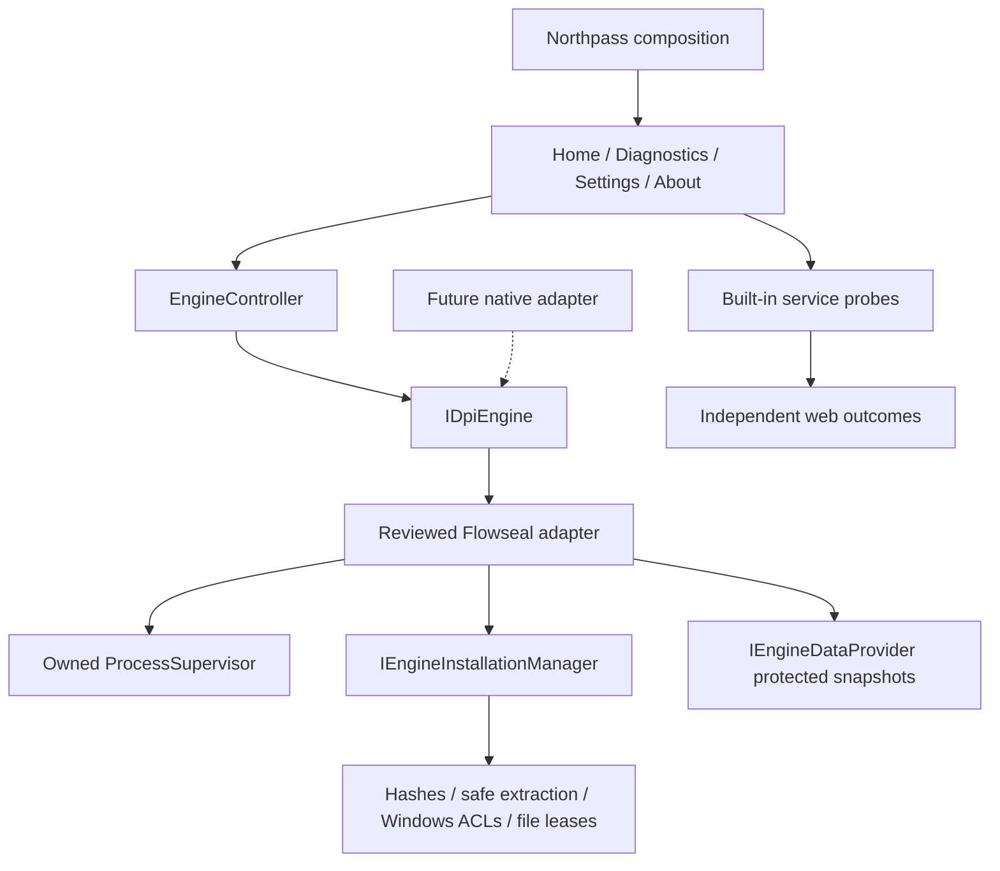

# Northpass v0.6 architecture

Northpass.App composes one reviewed Flowseal-derived Zapret1 adapter and installer. The view model has no executable picker, engine selection or raw-URL diagnostic flow. Only reviewed canonical profiles reach Home. The product layer references the compiled catalog; the controller, registry, installation/data APIs and process supervisor remain engine independent for a future replacement.

IDpiEngine exposes asynchronous start/stop/restart/status/validation and log/status events. The controller copies profiles, serializes lifecycle, stops only owned children and limits optional recovery to three attempts. The adapter accepts compiled ordered strategy arguments, typed numeric ports and validated data-only list bindings. Full PE/version/parser and protected-file checks precede capture. No BAT execution, external-code imports, global network/security mutation or external process killing occurs.

IEngineInstallationManager preserves pinned offline acquisition, sealed Program Files roots, cross-process locks, safe extraction, per-file integrity verification, transactional activation, explicit repair and reviewed-manifest update/rollback. IEngineDataProvider leases verified per-session snapshots until the owned child terminates. Process collisions fail with guidance. A shared loaded signed driver may remain until Windows unloads it; Northpass never deletes its global service.

MainViewModel presents localized strategy choices and service cards, separates busy connection operations from cancellable tracked diagnostics, and discards stale generations after strategy/session changes. Status events fetch the controller’s current state rather than applying stale queued notifications. Shutdown awaits cancellation/owned cleanup. Profile migration preserves user files and preferences while excluding unsupported engine IDs/changed argument arrays. Unreadable settings remain intact.

ServiceProbeService concurrently checks three fixed web endpoints with bounded DNS/TCP/authenticated TLS/HTTP stages. ServiceAvailabilityPolicy classifies web evidence only. QUIC/STUN/playback/login/gateway/voice/native Telegram messaging remain Unknown. Both Home and Diagnostics state this scope; detailed data/logs are collapsed. StrategyTestRunner remains explicit/manual, disconnects before and after each test and records local provider/revision/input evidence. No automatic strategy swapping or universal effectiveness is implied.

The entire app currently requests elevation as before; a privileged broker with an unelevated UI remains future work. The offline installer contains normal protected runtime files, licences and corresponding source packages. Release signing is optional and requires real credentials. See PRODUCT_V0.6.md, FLOWSEAL_REVIEW.md and WINDOWS_ACCEPTANCE.md for detailed behavior and acceptance limits.
