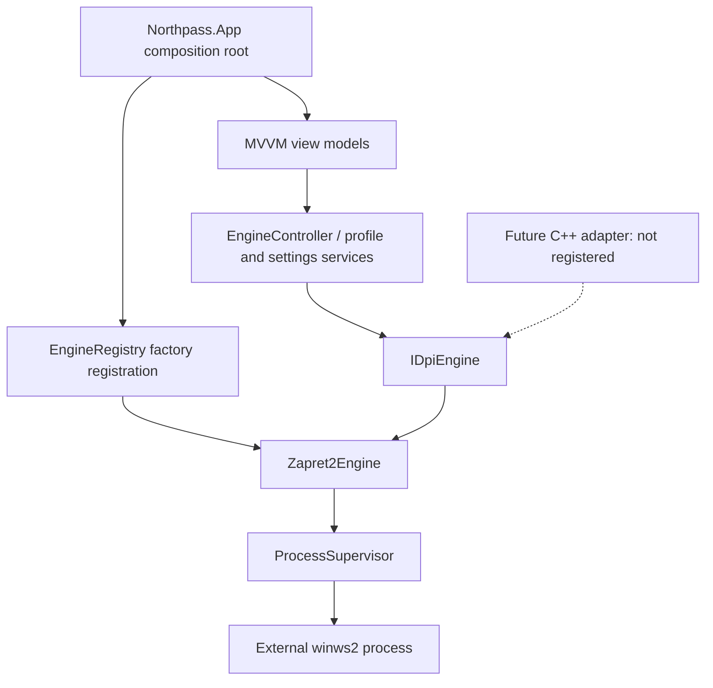

# Northpass v0.2 architecture

The v0.1 starter was a single `net8.0-windows` WPF project with synchronous `IEngineAdapter` calls and engine-specific code in `MainWindow.xaml.cs`. v0.2 preserves its WPF/.NET/JSON design, profile schema and administrator manifest while replacing that coupling with asynchronous engine-independent services.

`IDpiEngine` exposes `StartAsync`, `StopAsync`, `RestartAsync`, `GetStatusAsync`, and `ValidateConfigurationAsync`, with cancellation, log/status events and async disposal. Register a new factory in `App.xaml.cs` and implement the same contract to replace Zapret2. `EngineController` accepts the registry through constructor injection; the UI never instantiates an engine. A native implementation should encapsulate P/Invoke/IPC internally.

`ProcessSupervisor` serializes lifecycle transitions, owns one process, uses `ProcessStartInfo.ArgumentList` without a shell, drains both output streams, catches immediate startup exit and reports subsequent exit codes. Stop kills the owned process tree and waits up to five seconds. A failed stop retains ownership so it can be retried; the app remains open if cleanup fails. Restart cannot overlap another start. A status monitor observes real process liveness. This does not validate packet interception or successful bypass.

`Zapret2Engine` verifies Windows x64 before starting, checks file/profile configuration, logs the actual binary's `--version`, performs documented `--dry-run`, then launches interception. Probes and interception operations are serialized. The option-name/arity table is reviewed metadata for a pinned upstream revision; unknown/abbreviated options are rejected. The actual engine parser still decides validity of option values. Profiles cannot select an executable, run a shell or configure detached operation. Lua file loading is supported only after explicit trust confirmation; file Lua can execute arbitrary code and is not sandboxed.

`EngineController` copies the profile before launch so edits cannot mutate a live configuration. The UI requires disconnection before changing profiles. Recovery uses the copied configuration, a two-second delay and a budget of three attempts for the session. Explicit disconnect/exit cancels recovery. There is no automatic strategy search.

`ProfileStore` reads every JSON file independently, reports malformed and duplicate profiles, rejects unsafe IDs and protects existing imports. Writes replace files atomically. Relative engine references resolve against the engine working directory; placeholders resolve against the engine or saved profile directory. Import/export does not copy assets. Bundled profiles seed the writable user directory without replacing existing files. Unreadable settings are preserved and exposed as errors rather than silently overwritten.

`MainViewModel` contains commands, page data, busy state and session/diagnostic display. It receives services through its constructor and marshals background events through the WPF dispatcher. `MainWindow` code behind handles only window/tray lifetime and log scrolling. The application uses a per-user mutex to avoid multiple UI instances; Zapret2's own duplicate-filter check is kept enabled.

Diagnostics performs an explicitly requested HTTPS GET, preserves TLS validation, does not follow redirects, has a ten-second timeout, and reports the HTTP response independently from engine status. Update checking is opt-in metadata retrieval only; no remote binary is downloaded or executed. Neither feature transmits credentials or telemetry. Locally exported logs can contain file paths, engine output and tested hosts; review before sharing.

The entire UI is elevated as in the starter because the external WinDivert engine requires it. A separate least-privilege Windows service/IPC design is future work. No native adapter, update downloader, universal strategy or auto-selection success is simulated.
