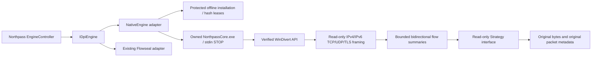

# Northpass Native Engine v0.1

NorthpassCore is an original C++20 experimental packet engine, built with CMake, MSVC and the Windows 10/11 x64 SDK. It is independent of the Zapret/Flowseal engine code and strategies. **It does not perform DPI bypass.** The premium v0.7 UI, RU/EN/AZ language preferences, web diagnostics and normal Flowseal connection path remain intact. Flowseal remains the production default/fallback; Northpass never silently substitutes a pass-through test for a bypass strategy.

## Architecture



The portable packet core is original source in `native/NorthpassCore`. IPv4 header/options and IPv6 extension chains are bounds checked; fragments, jumbograms and unsupported protocols are not reconstructed. TCP/UDP and complete same-packet TLS record/ClientHello framing are classified without port-based guesses, decryption, payload retention, SNI collection or stream reassembly. Framing is observational and unauthenticated. Malformed/unsupported packets still take the unchanged forwarding path. Deterministic malformed-input tests exercise 30,000 buffers under address/undefined-behavior sanitizers.

FlowTracker canonicalizes both directions, records packet/byte counters, observational TCP states and TLS framing, caps storage at 4,096 entries, evicts the oldest at capacity and expires idle UDP/TCP summaries after 30/120 seconds. Expiry is performed during packet activity. It does not certify OS connection establishment. No captured addresses or payloads are emitted in logs. Strategy receives read-only PacketView/FlowSummary and currently has one legal action: ForwardOriginal. Future mutation techniques require a separately reviewed interface change and tests; v0.1 cannot select them.

## Safe test scope and lifecycle

Only two compiled, typed scopes exist: `passthrough-idle` opens a false filter and captures no packets; `passthrough-loopback` requires a **dedicated reserved port 49152–65535**, IPv4 127.0.0.1 or IPv6 ::1, and TCP/UDP/both. Outbound loopback packets only, excluding impostors, are eligible. Arbitrary filters, scripts, command lines, lists, internet-wide interception and traffic modification are rejected. Do not choose a port used by another application. A future general network scope is deliberately not enabled yet.

The native executable checks its direct parent PID and holds a process handle. STOP, control-pipe closure, console cancellation or parent termination begin receive shutdown. It stops new interception and reinjects queued originals until ERROR_NO_DATA, with a three-second drain deadline. Pending overlapped operations are cancelled and awaited before their memory/events are destroyed. Queues are bounded to 512 packets / 1 MiB / 1 second. C# waits for the exact `NORTHPASS_READY protocol=1` line before Active, requests graceful STOP and waits five seconds before terminating only its owned child if necessary. No unrelated process or shared driver service is terminated. A native singleton plus existing cross-engine collision checks reject concurrent interception.

Receive/send, initialization, signing, ACL, integrity, validation and cleanup failures produce explicit logs/errors. Observation failure forwards its current original buffer before ending. Reinjection failure, queue overflow/expiry, forced termination or kernel failure **can lose scoped packets**; lossless operation is not promised. Closing a diversion handle stops its capture; it cannot undo effects on an already interrupted test stream. This is why v0.1 is restricted to isolated loopback tests. Native Active means driver readiness and process ownership, never DPI bypass or service availability.

## Trust, offline installation and licences

`native/windivert.json` pins the official WinDivert 2.2.2-A SDK release archive, source commit `1789526ecfb9ff5397c94f9f54c1a3dc2fb60440`, exact size and SHA-256 for archive/header/DLL/signed x64 driver/full licence/README. No latest discovery is used. The archive SHA-256 is `63cb41763bb4b20f600b6de04e991a9c2be73279e317d4d82f237b150c5f3f15`. CMake rechecks compile/runtime inputs; Windows packaging verifies the driver's actual Authenticode signature. NorthpassCore dynamically loads only the absolute reviewed DLL with DLL-directory/System32 search flags. Runtime rechecks DLL/driver bytes, protected ownership/ACLs and reparse points, and holds read-only/non-delete leases on its PE and dependency files.

`package-native.py` produces a deterministic ZIP for the exact built PE, a SHA-256 component manifest and corresponding source. The payload ID is the first 40 hex digits of the **payload hash**, not a Git commit. `SourceRevision` separately records the repository build revision. The immutable `OfflineBuild` manifest is embedded in Northpass.Engine.Native at managed compilation; external/downloaded JSON cannot authorize binaries. The existing safe extractor, sealed Program Files installation and per-file verification/leases are reused. Missing/corrupt offline payload fails closed with no network fallback. Only compiled manifests authorize optional repair/update/rollback; there is no auto-update from upstream assets.

The one-file installer contains the native payload, full upstream WinDivert licence/README, exact DLL/driver corresponding source, original NorthpassCore source/build metadata, existing Flowseal payload/notices/source and .NET notices. WinDivert is distributed under LGPLv3, retaining the upstream dual GPLv2 option. Dynamic linking and corresponding source preserve library modification/debugging rights. For a modified library, rebuild NorthpassCore with separately reviewed modified hashes and regenerate/compile the managed offline manifest; install that developer build with appropriate privileges. Do not bypass trust checks in a production build. See THIRD_PARTY_NOTICES.md and ENGINE_INSTALLATION.md. No licence has been invented for original Northpass code.

Non-administrator modification/DLL substitution is blocked; this is **not protection against an administrator, compromised host app, kernel attacker or machine-wide security compromise**. Whole-app elevation remains inherited from v0.7; an unelevated UI/privileged broker is future work. Windows enforces driver-signing policy. Driver images may remain loaded until unload/reboot; Northpass does not remove the shared service. No Defender, Firewall, Secure Boot, UAC, routes, DNS settings or global network configuration is changed. Default development artifacts are unsigned unless real release-signing credentials are supplied.

## Build and tests

Windows: install Visual Studio 2022 C++ tools/Windows SDK, CMake 3.24+, Python 3.10+, .NET SDK 8.0.425, and Inno Setup. In Administrator PowerShell:

```powershell
./scripts/build-native.ps1 # SDK integrity/signature; MSVC x64; 10 CTest groups; offline catalog
./scripts/test.ps1         # portable managed and actual Windows driver/UI tests
./scripts/build.ps1 -Installer
./scripts/test-installer.ps1
# Internal installed-app acceptance: idle capture, not a consumer engine switch
& "$env:ProgramFiles/Northpass/Northpass.exe" --native-check
```

Linux cloud: run `bash scripts/setup-cloud.sh`, `bash scripts/setup-native-cloud.sh`, source `/workspace/.northpass-tools/native-env.sh`, then run portable .NET tests. The pinned CMake wheel is checksum verified; the original packet core builds with g++ and sanitizers. Linux cannot run WPF, Windows drivers/ACL/elevation/installer tests. Build logs and tests must distinguish these platforms.

GitHub Actions builds/tests the portable core with sanitizers, managed tests on Linux/Windows, the real native PE on Windows, protected offline installation, unsafe ACL rejection, idle readiness, duplicate/collision prevention, unchanged IPv4 loopback UDP/TCP bytes, synthetic TLS framing counters, owned STOP/drain and real parent termination. Existing WPF RU/EN/AZ screenshots/Flowseal parser/driver checks and actual installer acceptance remain. Native failures fail CI rather than being described as successful interception. Artifacts include the self-contained application, one installer EXE, **NorthpassCore-0.1.0-win-x64**, and platform-specific test evidence.

## Next steps and unverified scope

Before widening capture: add a privileged broker, authenticated IPC, performance/backpressure profiling, failure injection under driver pressure, extensive IPv6 Windows loopback tests, capture/checksum-offload/MTU fixtures, flow retransmission/reassembly semantics, and a separately reviewed transformation API. Original desynchronization strategies and effectiveness evaluation are future work. No internet/real Russian ISP DPI behavior, streaming/Discord voice/Telegram messaging, general network interception, clean-machine UAC/Secure Boot matrix or commercial release certification is claimed by v0.1.
