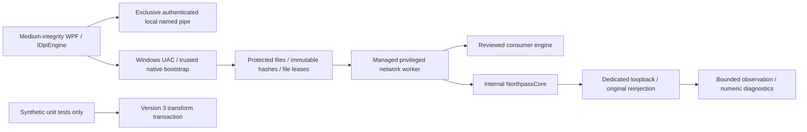

# Northpass Native Engine v0.3

NorthpassCore is original C++20 code. Native v0.3 forwards unchanged packets only; **it does not implement DPI bypass**. Native remains an internal experiment. The premium v0.7 WPF UI, Russian first-launch default, saved EN/RU/AZ choices, Home strategies, automatic service diagnostics, reviewed Flowseal consumer engine and single offline installer are preserved.

## Packet processing and transformation boundary

The receiver reinjects original bytes and original WinDivert metadata **before** fallible read-only observation. An eight-slot preallocated queue (about 0.5 MiB) skips and counts observations on saturation instead of delaying original forwarding. Packet capacity is 65,575 bytes; flow tracking caps at 4,096 with bounded LRU expiry. UDP expires after 30 seconds, TCP after 120, closing/reset TCP after five. TCP sequence/ACK tracking handles directional wrap, overlap, retransmission candidates, handshake transitions, FIN/RST and tuple reuse; it is not stream reconstruction.

IPv4/IPv6 parsing checks all offsets, exact lengths, options, extension sizes/order/duplicates, fragment fields and transport header lengths. Non-atomic fragments are classified without reconstruction and forwarded unchanged. Atomic IPv6 fragments can be observed independently. Unsupported/jumbo/ESP and malformed traffic retain original reinjection. TLS classification observes complete same-packet record/ClientHello framing without authentication/decryption. Synthetic malformed buffers are never injected into the network.

v0.3 additionally observes IPv4 header and TCP/UDP pseudo-header checksums for complete packets without IPv6 extensions. Offload validity bits determine whether a checksum can be evaluated; unspecified IPv4 UDP checksums and extension-header pseudo-header semantics remain unsupported. Invalid checksums are counted **after original forwarding**, never repaired. Original direction, loopback, impostor, IP version and checksum flags are preserved. Packets over 1,500 bytes are counted, not split or rejected: they may be valid large/offloaded packets. Synthetic transformation MTU limits are separate from live forwarding.

The version 3 `PacketTransaction` owns immutable original bytes and accepts at most 16 ordered, non-overlapping typed replacements. It rejects unknown versions/capabilities/scopes, excessive sizes, empty or overflowing ranges and structurally invalid results. Proposals are staged; only explicit commit exposes candidate bytes. Rejection/rollback restores the original. Configuration validates MTU and capabilities; strategy initialization/proposal failures trigger cleanup and original fallback. **Replacement capability is synthetic only.** Live scope accepts identity proposals only, and the driver pipeline never invokes the transformation framework. No live modification or broader capture is enabled.

## Privileged broker

See [BROKER_SECURITY.md](BROKER_SECURITY.md). The broker is introduced as a compile-time preview until actual Windows acceptance proves the medium-integrity UI/elevated worker boundary. The inherited production launch path is retained during that gate.

Native's existing owned stdin and authenticated named-pipe control paths remain supported. Shared global singleton prevents old/new duplicate engine startup. STOP/control closure/owner death begins a three-second receive drain, cancellation awaits pending overlapped I/O, then joins the receiver and drains observation before closing driver/DLL handles. Known owned-process termination is a bounded last resort. No unrelated process or shared driver service is stopped.

## Numeric diagnostics and benchmarks

Engine-neutral `IEnginePerformanceProvider` returns process CPU (normalized to logical processors), private bytes, lifetime captured rate, average/max capture-to-observation latency, queue size/peak/capacity, captured/forwarded/known dropped counts, skipped observations, active flows and recoverable/fatal/authentication errors. The existing Diagnostics log/export receives bounded numeric snapshots. No payloads, addresses, SNI, domains or flow keys are logged; transient packet buffers/endpoint keys exist only in bounded memory.

`NORTHPASS_METADATA` adds checksum/offload/metadata/large-packet counters. Counters are individually atomic, not a transaction. CPU starts at zero until an interval elapses. **`kernel_loss_unknown=1` always remains true**: WinDivert does not expose complete kernel overflow/expiry loss totals. Known drops are a lower bound. Backpressure counts skipped observations, not network loss. A zero known-drop counter never certifies lossless forwarding or service availability.

`native_benchmark` processes 200,000 synthetic packets with 4,096-flow eviction pressure and a conservative 20-second regression ceiling. Other tests cover concurrent queue pressure, bounded memory and transformation rollback. Synthetic rates include parsing/tracking and allocation, not driver throughput or hardware certification. Actual Windows loopback tests collect CPU/private bytes/rate/latency/queue metrics, but short CI samples are not sustained-network benchmarks. Consumer YouTube/Discord/Telegram cards still use real DNS/TCP/TLS/HTTPS probes, never process state.

## Fault injection and validation

`--test-capability --test-fault driver-open|send|observation-delay|crash` is a typed internal executable test contract; send/delay/crash require a dedicated loopback scope. Broker commands do not expose fault injection. Driver-open produces a clear startup error. Send suppresses one scoped reinjection and reports known loss/fatal error. Observation delay forces queue saturation while originals are forwarded immediately. Crash terminates the owned worker with exit 91; delivery/kernel loss becomes unknown. Existing tests exercise cancellation, malformed traffic, duplicates, IPC wrong peers/tokens/replay, disconnects and parent death.

Windows: VS 2022 C++/Windows SDK, CMake, Python, .NET SDK 8.0.425 and Inno Setup 6. `scripts/build-native.ps1` verifies the pinned SDK/driver signature, builds MSVC x64, runs 29 CTest groups and generates an immutable offline catalog. `scripts/build.ps1 -BrokerPreview` builds the protected bootstrap/worker and a medium-integrity WPF preview. `scripts/test-broker.ps1` runs the **actual published WPF process with a real restricted medium token**, an elevated bootstrap/worker, dedicated ::1 UDP integrity, reviewed Flowseal filter=false, repair, replay rejection, active IPC disconnect, desktop parent death and owned worker crash. The CI handoff replaces only the UAC click: it is not an interactive secure-desktop test. `scripts/build.ps1 -Installer` and `scripts/test-installer.ps1` produce/test the one-file offline package. Linux uses `scripts/setup-cloud.sh`, `scripts/setup-native-cloud.sh`, and `/workspace/.northpass-tools/native-env.sh` for ASan/UBSan and portable .NET tests.

GitHub Actions runs Linux and Windows tests with nonzero test-count checks and actual Windows driver fixtures. Failure fails CI. Evidence is stored in test artifacts and `docs/NATIVE_V03_VALIDATION.md`; only completed runs may be reported as passed. UI remains 0.7.0, Native module is independently 0.3.0. Artifact names are `NorthpassCore-0.3.0-win-x64`, `Northpass-0.7.0-installer`, `Northpass-win-x64` and test evidence.

## Supply chain, licences and limits

Official WinDivert SDK/source pins are unchanged in `native/windivert.json`; Windows verifies the reviewed driver's upstream Authenticode signature. Absolute DLL loading, protected ACLs, no reparse points, non-write/non-delete leases and immutable component hashes remain mandatory. Exact built Native PE hashes are embedded in managed assemblies before compilation. v0.3 uses `Program Files/Northpass-Native-0.3/<payload-id>/bin`; payload ID is its archive hash prefix, SourceRevision separately records the Git commit. Missing/corrupt offline payload fails closed with no download fallback. Only compiled current/previous reviewed catalogs authorize update/rollback.

Installer packages Native and Flowseal offline payloads, full legal notices/attribution, exact corresponding WinDivert source, original Native/broker/build sources and .NET notices. LGPLv3/upstream dual GPLv2 notices and developer library modification/debugging rights remain. No original-code licence is invented. Northpass artifacts are unsigned without real signing credentials; the driver retains its official signature. See `THIRD_PARTY_NOTICES.md`.

Trust does not protect against a local administrator, kernel attacker, injected/compromised authorized UI or signing/build compromise. Authentication is not a general sandbox; hostile peers can still cause availability pressure. Only idle or outbound dedicated 127.0.0.1/::1 TCP/UDP ports 49152–65535 excluding impostors are permitted for Native. UAC, Defender, Firewall, Secure Boot, DNS, routes and global network settings are never disabled/modified. No real Russian ISP effectiveness, DPI bypass, general-network safety or complete race freedom is claimed.

For v0.4: review the first original TCP/TLS strategy with deterministic synthetic fixtures and independently controlled endpoint/packet-capture experiments. Add pseudo-header extension/routing cases, TCP reassembly limits, hardware pressure measurements, Windows 10/11 clean-machine/UAC/signing matrix and independent security review before considering broader interception. Keep Flowseal as the consumer engine and all transformations disabled on ordinary traffic until those gates pass.
