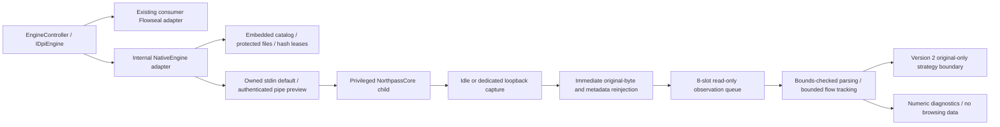

# Northpass Native Engine v0.2

NorthpassCore is original C++20 source, independent of Zapret/Flowseal strategies. **v0.2 performs unchanged pass-through only, not DPI bypass.** The v0.7 premium UI, Russian first-launch default, saved EN/RU/AZ choices, animation, Home strategies, automatic service diagnostics, Flowseal consumer engine and one-file offline installer remain intact. Unfinished Native features stay internal.

## Processing and bounded storage



The receiver reinjects original bytes and original WinDivert metadata **before observation**. Only the receiver sends packets, preserving captured order; parsing/strategy exceptions cannot prevent an already attempted original reinjection. Queue saturation skips/counts an observation rather than delaying traffic or allocating more storage. Fixed eight-slot storage is allocated before interception (about 0.5 MiB); packet buffers have a 65,575-byte ceiling. Flow storage caps at 4,096 entries with constant-time LRU eviction and once-per-second bounded expiry, including idle periods. No captured payloads, addresses, flow keys, SNI or domains are logged or persisted. Transient bounded packet buffers and flow endpoint keys exist in process memory during observation.

IPv4 validates exact total/header lengths, TTL, option TLVs, reserved/contradictory fragment flags, offsets and eight-byte fragment alignment. IPv6 validates exact length, hop limit, extension sizes/TLVs, duplicate headers, hop-by-hop placement, AH reserved fields, fragment reserved bits and alignment. Non-atomic fragments are classified without reconstruction; atomic IPv6 fragments can be parsed independently. Unsupported/jumbo/ESP traffic and malformed buffers retain original forwarding. TCP/UDP lengths/options are bounds checked. TLS classification is unauthenticated complete same-packet record/ClientHello framing, without stream reconstruction or decryption. Checksum verification is deliberately absent: driver checksum-offload metadata is retained and traffic is never repaired or rewritten.

TCP tracking records wrap-safe directional sequence high-water marks, overlap/retransmission candidates, gaps and duplicate ACKs. SYN/SYN-ACK/ACK establishment requires matching directions and acknowledgement values; retransmitted handshakes cannot downgrade Established. FIN/RST remain terminal until tuple reuse. This is observational tracking, not complete TCP reassembly or proof that the OS accepted traffic. Idle UDP expires after 30 seconds, normal TCP after 120, closing/reset TCP after five. Fragment/retransmission/extension behavior is tested with synthetic buffers, not injected malformed live traffic.

## Reliability, metrics and strategy boundary

STOP, owner termination, console cancellation or control closure stop new interception and begin a three-second driver receive drain. Pending overlapped receive/control operations are cancelled and awaited before buffers/events are destroyed; the receiver joins and the observation queue drains before DLL/driver handles close. The driver queue separately caps at 512 packets / 1 MiB / 1 second. Cancellation during startup retains owned cleanup; graceful stop is bounded before owned-process termination fallback. The singleton is shared with v0.1 to prevent direct old/new worker overlap. No unrelated process or shared driver service is killed.

`NORTHPASS_METRICS protocol=2` reports normalized process CPU, private memory, lifetime mean captured packets/second, capture-to-completed-observation average/max latency (including queue wait), queue occupancy/peak/capacity, captured/forwarded/known dropped packets, skipped observations/backpressure, active flows and recoverable/fatal/authentication errors. Snapshot counters are individually atomic, not an all-fields transaction. CPU is normalized across available logical processors; its initial sample is zero. `backpressure` counts **skipped observations**, not network drops. WinDivert does not expose reliable kernel overflow/expiry loss totals: **`kernel_loss_unknown=1` always remains true**, even when `dropped_known=0`. No lossless or sustained throughput claim is made. Send/framing failures count known drops; receive/drain/control failures are fatal with explicit nonzero exit/errors. Actual drop counts are a lower bound.

The engine-neutral `IEnginePerformanceProvider` and controller diagnostics method return a typed numeric snapshot. Native stdout snapshots appear in existing diagnostic logs; log export includes the latest available snapshot. Authenticated IPC additionally supports an on-demand snapshot. Managed parsing rejects duplicate/unknown/missing fields, unsupported versions, non-finite/negative measurements and out-of-range queue/flow/CPU values. Normal consumer availability cards still use actual DNS/TCP/TLS/HTTPS probes, never these counters or process state.

Strategies declare interface version, typed capability bits, identifier and mutation limit. Version 2 accepts only `original`, Observe + ForwardOriginal, zero mutations. Read-only `PacketView` borrows a buffer only for its invocation; strategies must not retain that span/flow pointer. The processor returns the exact original span on success, exceptions or invalid actions and counts rollback/recoverable errors. A future transformation path needs a separately reviewed API, immutable original storage, explicit validated configuration and failure rollback tests; v0.2 cannot enable mutation or broaden capture.

## Protected local IPC preview and privilege boundary

**The production owned-stdin launch remains the default.** Internal `NativeEngine(..., useNamedPipe: true)` and installed-app `--native-ipc-check` exercise the new channel. No engine selector or Native option appears in ordinary UI.

The pipe name contains a random 128-bit per-launch ID. Native creates the first/only instance with `FILE_FLAG_FIRST_PIPE_INSTANCE`, remote-client rejection, a protected DACL permitting SYSTEM and the parent's actual logon SID only, and a medium mandatory integrity label. Client read/write/synchronize rights exclude `FILE_CREATE_PIPE_INSTANCE`. Parent PID must be the live direct creator, held through a process handle. Server additionally verifies `GetNamedPipeClientProcessId`, user SID and logon SID against that owner. Client verifies `GetNamedPipeServerProcessId` against its owned live process. A preclaimed pipe or a different same-user process is rejected.

A fresh 256-bit authentication token travels through inherited private stdin, never process arguments, environment, files or logs. Only the expected parent can authenticate; token comparison is constant-time over its fixed-length bytes. Authentication precedes driver initialization. Frames are four-byte little-endian length + printable ASCII, at most 2,048 bytes. Authentication is exact `AUTH 2 <64 lowercase hex>`; commands are exact `PING 2 n`, `METRICS 2 n`, `STOP 2 n` with strictly increasing canonical uint32 sequence numbers. No arbitrary filters, paths, executables, scripts or strategy mutation commands exist. Invalid/replayed/oversized/truncated messages fail closed; connection/frame deadlines and attempt limits bound stalls. Channel/parent closure cancels interception. Token buffers are cleared where possible; managed immutable temporary strings remain subject to GC, not guaranteed secure-memory erasure.

The privileged worker disables token privileges before driver initialization, retains only its inherited Administrators membership for the existing SCM-mediated reviewed driver startup, and never impersonates clients or changes machine policy. The IPC model is designed for a future medium-integrity UI and narrow privileged worker. **The current WPF application still has its inherited administrator manifest; an unelevated UI/UAC broker handoff is not implemented in v0.2.** These tests do not certify a medium-integrity client or clean-machine elevation path. Changing that working launch path remains deferred until a real broker/IPC Windows integration matrix passes.

## Supply chain, offline installation and legal obligations

The official WinDivert 2.2.2-A SDK/source pins, immutable SHA-256 archive/component manifest, actual Windows signed-driver verification, absolute reviewed DLL loading and read-only/non-delete leases remain unchanged. See `native/windivert.json` and `THIRD_PARTY_NOTICES.md`. No latest release lookup, arbitrary dependency replacement or downloaded catalog can authorize a binary.

The exact built Native PE and reviewed dependencies are bundled in a deterministic offline ZIP; its manifest is embedded in the managed assembly before compilation. The payload ID is its hash prefix, while SourceRevision separately records the Git build revision. Protected extraction rejects traversal/reparse points/untrusted ACLs and verifies each component. Missing/corrupt offline payload fails closed, without network fallback. v0.2 uses `Program Files/Northpass-Native-0.2/<payload-id>/bin`; it does not silently trust or delete an obsolete v0.1 selection. Optional repair/update/rollback can use only manifests compiled into that release; v0.2 does not authorize arbitrary old or external manifests.

The single installer includes Native and Flowseal payloads, full third-party licences/notices, exact corresponding WinDivert source, original NorthpassCore/build source and .NET notices. WinDivert's LGPLv3 and upstream dual GPLv2 option are preserved. Modified-library developer builds must update reviewed hashes and rebuild the embedded catalog; legal library modification/debugging rights are retained. No original-code licence is invented. Native source redistribution includes this document and reliability tests. Default Northpass artifacts are unsigned unless real signing credentials are supplied; the reviewed kernel driver retains its upstream signature.

Trust checks prevent unprivileged file replacement, not a local administrator, compromised allowed parent, injected host process, kernel attacker or host security compromise. A hostile process can still cause availability pressure; authentication is not a general sandbox. Driver/service images can remain loaded until unload/reboot. Defender, Firewall, Secure Boot, UAC, routes, DNS and global network configuration are never disabled or modified.

## Build and validation

Windows requires VS 2022 C++/Windows SDK, CMake, Python, .NET SDK 8.0.425 and Inno Setup. In administrator PowerShell:

```powershell
./scripts/build-native.ps1 # verified SDK/signature; MSVC x64; 22 CTest groups; offline catalog
./scripts/test.ps1         # managed + actual Windows UI/driver/IPC tests
./scripts/build.ps1 -Installer
./scripts/test-installer.ps1
& "$env:ProgramFiles/Northpass/Northpass.exe" --native-check     # existing stdin, idle only
& "$env:ProgramFiles/Northpass/Northpass.exe" --native-ipc-check # authenticated IPC, idle only
```

Linux: `bash scripts/setup-cloud.sh`, `bash scripts/setup-native-cloud.sh`, then source `/workspace/.northpass-tools/native-env.sh`. Linux tests use ASan/UBSan, deterministic mutated/malformed IPv4/IPv6 buffers, fragments/atomic fragments, TCP wrap/retransmissions/states, UDP expiry/LRU, strategy rollback, bounded memory, 80,000 concurrent queue admission attempts, metrics atomics and strict IPC codec tests. The synthetic 100,000-packet performance test has a conservative regression deadline; it is not network throughput validation or proof of race freedom.

GitHub Actions runs Linux portable managed/native tests, actual MSVC Windows x64 tests, real protected offline install/ACL/file leases, driver idle and dedicated IPv4 UDP/TCP loops, IPv6 UDP integrity, owned lifecycle/parent death, named-pipe authenticated metrics, wrong-PID/wrong-token/replay/squatting rejection, existing Flowseal/WPF localization screenshots, and published single-EXE installer acceptance including both internal native control paths. Windows failures fail CI; tests must not be described as real networking until that run succeeds. Artifacts: `NorthpassCore-0.2.0-win-x64`, `Northpass-0.7.0-installer`, `Northpass-win-x64`, and test evidence. App/UI version intentionally remains 0.7.0; Native module version is independently 0.2.0.

## Remaining limits / recommended Native v0.3 work

Keep capture confined to **idle or a reserved loopback port 49152–65535**, IPv4 127.0.0.1 / IPv6 ::1, outbound TCP/UDP/both, excluding impostors. No general-network filter or mutation is available. There is no real Russian ISP, streaming/voice/messaging effectiveness or DPI bypass claim.

Next: build and verify a true unelevated UI/elevated worker broker (including UAC denial, medium/low/remote clients and Windows 10/11/Secure Boot matrix); add controlled send/driver failure injection and kernel-pressure analysis; measure release latency/throughput and peak working sets on hardware; run ThreadSanitizer where supported; extend IPv6 TCP/checksum-offload/MTU/reassembly fixtures; design a separately versioned immutable-original transformation transaction before any original TCP/TLS or UDP/QUIC desynchronization strategy. General interception must await independent safety review and clean-machine network validation.
